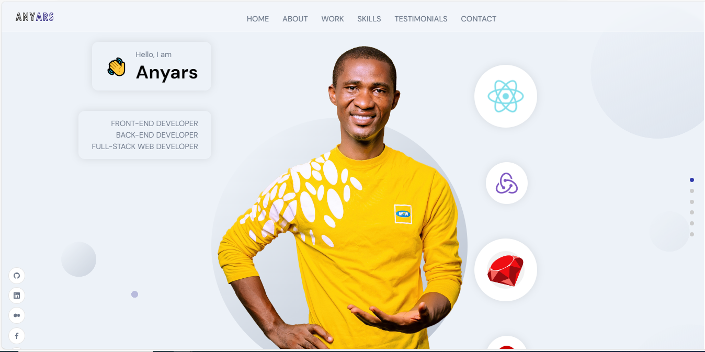

<a name="readme-top"></a>

<div align="center">

 <!-- LOGO -->

  
  <br/>

<!-- MAIN HEADING -->

  <h3><b>Anyars | Portfolio</b></h3>

</div>

<!-- TABLE OF CONTENTS -->
# 📗 Table of Contents

- [📖 About the Project](#about-project)
  - [🛠 Built With](#built-with)
    - [Tech Stack](#tech-stack)
    - [Key Features](#key-features)
  - [🚀 Live Demo](#live-demo)
- [💻 Getting Started](#getting-started)
  - [Setup](#setup)
  - [Prerequisites](#prerequisites)
  - [Install](#install)
  - [Run tests](#run-tests)
  - [Deployment](#deployment)
- [👥 Authors](#authors)
- [🔭 Future Features](#future-features)
- [🤝 Contributing](#contributing)
- [⭐️ Show your support](#support)
- [🙏 Acknowledgements](#acknowledgements)
- [❓ FAQ (OPTIONAL)](#faq)
- [📝 License](#license)

<!-- INTRO -->
# 📖 Anyars | Portfolio <a name="about-project"></a>

> This is a Full-stack Portfolio project built with ReactJS and Sanity Studio to showcase my skills, achievements and abilities.
Watch this [Video](https://www.loom.com/share/d61ef8b260cf44faaad891c75b2531bc?sid=a04ee694-76da-4c31-b39f-248350f8136d) for a demontration of the project.

## 🛠 Built With <a name="built-with"></a>
1. React.js
2. Sanity
3. Framer Motion
4. Email JS
5. SCSS

### Tech Stack <a name="tech-stack"></a>

<details>
  <summary>Client</summary>
  <ul>
    <li><a href="https://legacy.reactjs.org/">React.js</a></li>
    <li><a href="https://www.sanity.io/">Sanity</a></li>
    <li><a href="https://www.framer.com/motion/">Framer Motion</a></li>
    <li><a href="https://www.emailjs.com/">Email JS</a></li>
    <li><a href="https://sass-lang.com/">SCSS</a></li>
  </ul>
</details>

<!-- Features -->

### Key Features <a name="key-features"></a>

👉 **Header Section**: Includes animations using Framer Motion.

👉 **About Section**: Includes animations with Framer Motion and React Tilt.

👉 **Works Section**: Includes animations with Framer Motion and React Tilt.

👉 **Skills & Experiences Section**: Includes animations with Framer Motion.

👉 **Testimonials and Brands Section**:Includes animations with Framer Motion and a slider to loop through testimonials.

👉 **Contact Section**: Includes animations with Framer Motion. Functions with EmailJS.

👉 **Consistent Animations**: Implements cohesive animations throughout the website using framer motion.

👉 **Responsive Design**: Ensures optimal display and functionality across all devices.

<p align="right">(<a href="#readme-top">back to top</a>)</p>

<!-- LIVE DEMO -->

LIVE DEMO

> Visit the [live](https://anyars-encarta.github.io) page of my Portfolio.

<p align="right">(<a href="#readme-top">back to top</a>)</p>

<!-- GETTING STARTED -->

## 💻 Getting Started <a name="getting-started"></a>

> To get a local copy up and running, follow these steps.
> 
```sh
cd full-stack-portfolio
https://github.com/anyars-encarta/full-stack-portfolio.git
```

### Prerequisites

1. A Browser (Preferably Google Chrome)
2. A Code Editor
3. Internet Connection
4. Git

<!-- SETUP -->
### Setup

To run the project, run the following command:

Front-end
```sh
cd frontend_react
  npm start
```

Back-end
```sh
cd backend_sanity
  npm run dev
```
<!-- INSTALL -->

### Install

Install this project with the latest version of Git and a code editor.

### Deployment

You can deploy this project using:
>1. A Code Editor
>2. Latest version of Git

<p align="right">(<a href="#readme-top">back to top</a>)</p>

<!-- AUTHORS -->
## 👥 Authors <a name="authors"></a>

👤 **Anyars Yussif**

- GitHub: [@anyars-encarta](https://github.com/anyars-encarta)
- Twitter: [@anyarsencarta](https://twitter.com/anyarsencarta)
- LinkedIn: [LinkedIn](https://www.linkedin.com/in/anyars-yussif/)


<p align="right">(<a href="#readme-top">back to top</a>)</p>

## 🔭 Future Features <a name="future-features"></a>

- [ ] **Add More Projects**

<p align="right">(<a href="#readme-top">back to top</a>)</p>

<!-- CONTRIBUTION -->
## 🤝 Contributing <a name="contributing"></a>

Contributions, issues, and feature requests are welcome!

<p align="right">(<a href="#readme-top">back to top</a>)</p>

<!--SUPPORT -->

## ⭐️ Show your support <a name="support"></a>

> If you like this project, please give it some starts ⭐️⭐️⭐️⭐️⭐️

<p align="right">(<a href="#readme-top">back to top</a>)</p>

<!-- ACKNOWLEDGEMENTS -->
## 🙏 Acknowledgments <a name="acknowledgements"></a>

> Special acknowledgement to [@adrianhajdin](https://github.com/adrianhajdin) and [@microverseinc](https://github.com/microverseinc)

<p align="right">(<a href="#readme-top">back to top</a>)</p>

<!-- FAQS -->
## ❓ FAQ (OPTIONAL) <a name="faq"></a>

- **How were the Linters utilised?**

  - The Linters were utilised with the help of resources provided by [@microverseinc](https://github.com/microverseinc).

- **What new features should be expected in the next release of the project?**

  - I am currently working on adding **achievemnets**.

<p align="right">(<a href="#readme-top">back to top</a>)</p>

<!-- LICENSE -->

## 📝 License <a name="license"></a>

This project is [MIT](./LICENSE) licensed.

<p align="right">(<a href="#readme-top">back to top</a>)</p>